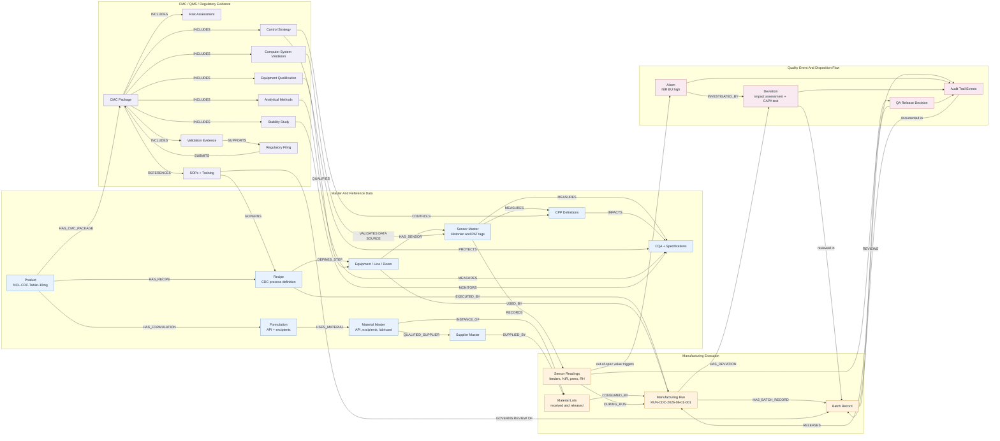

# Reference Architecture for CDC Manufacturing Data Flow

This diagram shows how data flows into and through the CDC manufacturing knowledge graph. It separates source systems and governed master/reference data from manufacturing execution evidence, quality review, and CMC/regulatory use.

For printing or review on a single page, use the A4 landscape version:

[cdc-data-flow-a4.html](cdc-data-flow-a4.html)



## Data Flow Summary

1. Master and reference data define the product, formulation, recipe, materials, suppliers, equipment, sensors, CPPs, CQAs, and specifications.
2. Manufacturing execution data records the run, consumed material lots, sensor readings, cleaning/calibration evidence, and batch record.
3. Quality event data links out-of-spec readings to alarms, deviations, impact assessments, audit trail events, and QA disposition.
4. CMC/QMS evidence connects the same process and quality evidence to control strategy, analytical methods, stability, validation, SOPs, training, qualification, CSV, and regulatory filing context.

## Key Architecture Point

The graph does not just store execution data. It connects each execution fact to the master data and governance context needed to interpret it. For example:

```text
SensorReading -> Sensor -> CPP/CQA -> Specification -> ControlStrategy -> CMCPackage -> RegulatoryFiling
```

and:

```text
ManufacturingRun -> MaterialLot -> Material -> CriticalMaterialAttribute -> RiskAssessment -> ControlStrategy
```
