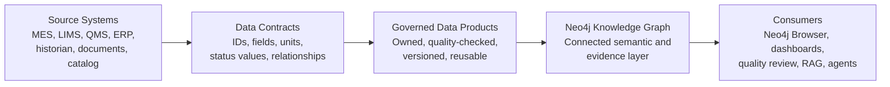

# CDC Data Products

This document explains how data products fit into the CDC manufacturing knowledge graph reference architecture.

The short version: data products are governed, reusable packages of trusted data and meaning. The knowledge graph connects those data products so people, dashboards, and AI-assisted agents can answer cross-functional questions with traceable evidence.

## Why This Document Exists

The reference architecture already includes a semantic model, logical model, canonical model, information architecture model, integration model, provenance model, ontology, Neo4j graph, and agent layer.

Data products explain how those models become reusable enterprise capabilities rather than one-off data extracts or isolated prototypes.

This document helps answer:

- Where do data products sit in the architecture?
- Which CDC manufacturing data products would be useful?
- Who owns a data product?
- What makes a data product trustworthy?
- How do data products relate to the knowledge graph and AI/RAG layer?
- What is the impact if data products are not defined?

## What Is A Data Product?

A data product is a reusable data capability with a clear purpose, owner, consumers, contract, quality expectations, access rules, lineage, and support model.

In this reference architecture, a data product should not mean "a table" or "a dashboard." It means a governed package of data and meaning that can be safely reused.

Typical data product attributes:

| Attribute | Meaning |
| --- | --- |
| Purpose | The business question or decision the product supports. |
| Owner | The accountable business or data owner. |
| Consumers | Teams, systems, reports, agents, or workflows that use it. |
| Contract | Defined fields, identifiers, relationships, allowed values, and service expectations. |
| Quality rules | Completeness, validity, timeliness, consistency, and traceability checks. |
| Lineage | Where the data came from and how it was transformed. |
| Access rules | Who can use it and under what conditions. |
| Evidence | Documents, records, or provenance that support trust in the data. |
| Lifecycle | How changes, versions, retention, and deprecation are managed. |

## How Data Products Fit Into The Model Stack

Data products sit between source systems and consumption. They use the modelling artifacts to become consistent, governed, and reusable.

```text
Source systems
  -> canonical data objects
  -> governed data products
  -> Neo4j knowledge graph
  -> query packs, dashboards, RAG, and agents
```

Relationship to existing artifacts:

| Existing Artifact | How It Supports Data Products |
| --- | --- |
| Glossary | Gives the data product shared terms and acronyms. |
| Semantic data model | Defines what the product's concepts and relationships mean. |
| Logical data model | Defines the entities, identifiers, and relationship rules. |
| Canonical data model | Defines exchange objects and field groups used to publish or consume the product. |
| Information architecture model | Defines ownership, stewardship, domains, and navigation. |
| Integration model | Defines how the product is sourced, validated, and supplied to the graph. |
| Provenance/evidence model | Defines how the product proves where values, mappings, and decisions came from. |
| Ontology | Formalises the product's meaning for machine interpretation. |
| Neo4j graph | Connects data products into a cross-domain knowledge layer. |
| RAG manifest and agent | Consume approved data/document context to answer questions with evidence. |

## Data Product View Of The Architecture



## Candidate CDC Data Products

The table below shows production-inspired data products that fit this reference architecture.

| Data Product | Purpose | Typical Owner | Key Consumers |
| --- | --- | --- | --- |
| Product And Formulation Data Product | Trusted product, formulation, recipe, material, and specification definitions. | CMC / product development. | Manufacturing, quality, regulatory, graph, agent. |
| Material Genealogy Data Product | Material lots, supplier context, release status, consumption, and batch impact traceability. | Supply chain / quality. | QA, manufacturing, batch review, impact assessment. |
| Process Execution Data Product | Manufacturing runs, process steps, equipment, sensor readings, CPP values, and execution status. | Manufacturing / MES ownership. | Operations, MSAT, quality, graph analytics. |
| Quality Event Data Product | Alarms, deviations, investigations, batch records, CAPA context, and QA disposition. | QA / QMS ownership. | QA, regulatory, batch review, audit readiness. |
| CMC Evidence Data Product | Control strategy, validation evidence, methods, stability, regulatory sections, and filing support. | Regulatory / CMC. | Regulatory, quality, CMC, evidence review. |
| CDE Governance Data Product | Critical data elements, owners, stewards, source systems, quality rules, value domains, and standards mappings. | Data governance / data owners. | Data platform, quality, AI/RAG, architecture. |
| Provenance And Evidence Data Product | Evidence documents, provenance statements, audit trail anchors, and support relationships. | Quality / data governance. | QA, audit, regulatory, agent evaluation. |
| AI Evidence Data Product | Approved question registry, approved Cypher templates, RAG manifest records, answer checks, and retrieval metadata. | AI governance / architecture. | Laravel agent, evaluators, platform teams. |

These products can be implemented separately, but their value increases when the knowledge graph connects them.

## Example Data Product Contract

A lightweight data product contract for material genealogy might include:

```text
Data product: Material Genealogy
Purpose: Trace manufacturing runs to consumed material lots, material masters, and suppliers.
Owner: Quality / supply chain.
Primary consumers: QA batch review, impact assessment, Neo4j graph, agent evidence queries.

Required identifiers:
  materialLotId
  materialId
  supplierId
  runId

Required relationships:
  MaterialLot INSTANCE_OF Material
  MaterialLot SUPPLIED_BY Supplier
  ManufacturingRun CONSUMES MaterialLot

Quality rules:
  Every consumed lot must have a material master.
  Every consumed lot must have a supplier.
  Every consumed lot must be connected to at least one run.
  Lot status must use an approved controlled vocabulary.

Evidence:
  Receiving record
  CoA or QC release evidence
  Batch record consumption evidence
```

The Neo4j seed scripts implement a demo version of this pattern using `Material`, `MaterialLot`, `Supplier`, and `ManufacturingRun` nodes.

## How Data Products Relate To The Knowledge Graph

A data product can be consumed by many systems. The graph is one consumer, but it is a special one because it connects products across domains.

For example:

```text
Material Genealogy Data Product
  -> material lots and suppliers

Process Execution Data Product
  -> runs, equipment, readings

Quality Event Data Product
  -> alarms, deviations, QA decisions

Knowledge Graph
  -> connects all three into an impact assessment path
```

The graph should store enough data to answer connected questions, but it does not need to copy every raw source record. Source systems remain systems of record.

## How Data Products Relate To AI Readiness

AI-assisted tools need more than data access. They need trusted context.

Data products support AI readiness by making these things explicit:

- what the data means;
- which identifiers are stable;
- which values are allowed;
- who owns the data;
- which rules define quality;
- where the data came from;
- which evidence supports it;
- whether it is appropriate for a given question.

The Laravel agent in this repository demonstrates this pattern by using:

- approved question definitions;
- approved Cypher templates;
- Neo4j graph evidence;
- RAG manifest document metadata;
- deterministic expected-answer checks.

In an enterprise version, data products would provide the governed inputs that the graph and agent rely on.

## Do We Need A Vector Database?

Possibly, but it depends on the retrieval requirement. A vector database is useful for semantic search over text, document chunks, SOPs, evidence summaries, regulatory narratives, glossary entries, and architecture documentation. It is not a replacement for the knowledge graph, source systems, data products, or governed evidence.

In this reference architecture:

```text
Data products
  provide governed data and contracts.

Knowledge graph
  connects entities, relationships, evidence, provenance, and meaning.

Vector database
  can retrieve relevant text passages by semantic similarity.

Agent/RAG layer
  can combine graph evidence, retrieved text, approved templates, and answer guardrails.
```

Use a vector database when:

- users need natural-language search across many documents;
- SOPs, validation reports, regulatory narratives, or evidence documents are too large to inspect manually;
- the agent needs to retrieve relevant explanatory text before composing an answer;
- search terms may not exactly match document wording;
- you need ranking across many document chunks.

Do not use a vector database as the source of truth for:

- batch genealogy;
- material lot traceability;
- QA release or rejection status;
- sensor readings;
- controlled vocabulary values;
- CDE ownership;
- regulatory evidence relationships;
- graph relationship meaning.

Those are better handled by source systems, governed data products, and the knowledge graph.

## Graph Versus Vector Database

The two technologies answer different questions.

| Question | Better Fit |
| --- | --- |
| Which material lots were consumed by this run? | Knowledge graph. |
| Which supplier supplied the affected lot? | Knowledge graph. |
| Which deviation investigated this alarm? | Knowledge graph. |
| Which evidence document text discusses blend uniformity control? | Vector database or document search. |
| Which SOP section is semantically similar to this user question? | Vector database. |
| Which CDE supports CTD Module 3.2.P.3.3? | Knowledge graph. |
| Which documents should an agent read before answering a CMC evidence question? | Graph plus vector database. |

The strongest pattern is usually hybrid:

```text
User question
  -> classify intent
  -> run approved graph query for facts and relationships
  -> retrieve relevant document chunks from vector search
  -> compose answer using graph evidence first, text evidence second
  -> cite graph query and document sources
```

## Vector Database As A Data Product Consumer

A vector index should normally consume governed document or evidence data products. It should not become an unmanaged copy of random files.

For example:

```text
Evidence Document Data Product
  -> approved documents, metadata, version, owner, classification
  -> chunking and embedding pipeline
  -> vector index
  -> RAG retrieval
  -> agent answer with citations
```

Minimum governance expectations for vector search:

- document source and owner are known;
- document version is captured;
- chunks can be traced back to source documents;
- sensitive or restricted content is excluded or access-controlled;
- embeddings can be refreshed when documents change;
- retrieval results are evaluated against expected questions;
- generated answers cite graph evidence and document evidence separately.

For this demo repository, `docs/rag-manifest.jsonl` acts as a lightweight substitute for a vector index. It records retrievable sources, summaries, tags, likely questions, and priority. A production implementation could use the manifest as input to an embedding and vector indexing pipeline.

## Ownership And Operating Model

Data products need business ownership, not only technical ownership.

| Responsibility | Typical Role |
| --- | --- |
| Business value and prioritisation | Product owner / business data owner. |
| Data meaning and definitions | Information architect, data owner, SME. |
| Logical structure and contracts | Data architect. |
| Source-system mapping and pipelines | Data engineer / integration engineer. |
| Quality rules and acceptance criteria | Data steward, quality SME, data governance. |
| Evidence and audit expectations | Quality, regulatory/CMC, validation/CSV. |
| Graph consumption and query patterns | Graph engineer. |
| AI/RAG use and answer guardrails | AI/RAG engineer, AI governance. |
| Access and runtime controls | Security and platform engineering. |

The important point is that a data product is not finished when a pipeline runs. It is finished when consumers can use it safely, understand its meaning, trust its quality, and know who owns it.

## What Happens If Data Products Are Not Defined?

Without data products, teams may still load data into a graph, but the architecture becomes harder to scale.

Typical impacts:

- source-system extracts become one-off and difficult to reuse;
- different teams create conflicting definitions of the same concept;
- graph loading logic becomes tightly coupled to each source system;
- quality rules are hidden in code or manual checks;
- ownership is unclear when values are wrong;
- AI/RAG answers may use data without knowing whether it is trusted;
- the graph becomes a demo rather than a governed enterprise capability.

Data products reduce these risks by making ownership, contracts, quality, lineage, and evidence explicit.

## Minimum Viable Data Product

For a proof of concept, avoid over-engineering. A minimum viable data product should define:

1. The business question it supports.
2. The owner and steward.
3. The source system or source document.
4. Stable identifiers.
5. Required fields and relationships.
6. Controlled values and units where relevant.
7. Quality checks.
8. Evidence or lineage.
9. Consumers and access assumptions.
10. Change/version expectations.

If those ten points are unclear, the data product is not ready for reliable graph or AI-assisted consumption.

## Beginner Example

If an executive asks, "Why was this batch rejected?", the answer cuts across several data products:

```text
Product And Formulation
  gives product and recipe context.

Process Execution
  gives the run, equipment, and sensor readings.

Quality Event
  gives the alarm, deviation, and QA rejection.

Material Genealogy
  gives lots and suppliers used in the run.

Provenance And Evidence
  gives batch record and investigation support.

Knowledge Graph
  connects those products into one evidence path.
```

That is the reason data products and knowledge graphs work well together: the data products make domains trustworthy, and the graph connects them into enterprise knowledge.

## Limitations

This document describes a reference architecture pattern. It does not implement production data product tooling, data contracts, lineage systems, access control, service-level objectives, or operational support processes.

For regulated production use, data products would need quality approval, validation assessment, data integrity controls, change control, access controls, monitoring, and support ownership.
