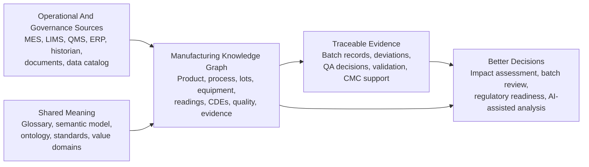
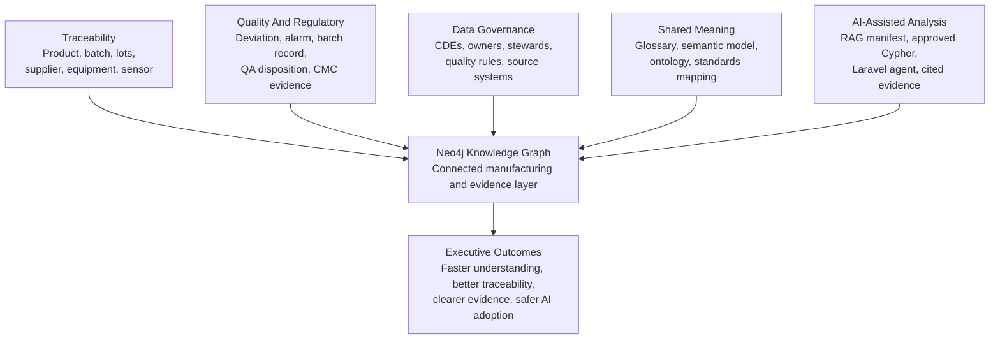

# Executive Summary: CDC Manufacturing Knowledge Graph Reference Architecture

This document explains the reference architecture for senior stakeholders who need to understand the business value, operating model, and strategic relevance without needing to read Cypher, Neo4j internals, or ontology files first.

The short version: this project shows how pharmaceutical manufacturing, quality, regulatory, and data governance information can be connected into an evidence-based knowledge graph. That connected graph can support traceability, CMC evidence management, critical data element governance, and controlled AI-assisted analysis.

## What This Is

This is a public reference architecture for a fictional Continuous Direct Compression (CDC) pharmaceutical tablet product called `NCL-CDC-Tablet-10mg`.

It models how data and evidence flow across a manufacturing process, from upstream crystallisation through continuous tablet manufacture and semi-continuous powder coating. It also shows how the same data can be connected to quality review, regulatory evidence, ontology, standards, and an AI-assisted question-answering layer.

It is not a production system. It is a production-inspired demonstration model intended to make complex manufacturing data architecture easier to discuss, test, and explain.

## Why It Matters

Many regulated manufacturing organisations have the same structural problem: important knowledge is spread across MES, LIMS, QMS, ERP, historians, spreadsheets, documents, data catalogs, and regulatory systems.

Each system may be valuable on its own, but the highest-value questions often cut across systems:

- Which material lots contributed to this released or rejected run?
- Which supplier, equipment, sensor, or process step was involved?
- Which process parameter affected a quality attribute?
- Which deviation, alarm, or reading supports a QA decision?
- Which CDEs support a CMC section or regulatory submission?
- Which evidence should an AI assistant cite before giving an answer?

A knowledge graph is useful because it makes those connections explicit. It does not replace source systems. It links them into a shared context that humans, governance teams, and AI-assisted tools can inspect.

## Executive Value Flow

The diagram below shows the business-level flow. Source systems continue to own operational records. The knowledge graph connects selected records, definitions, and evidence so that users and AI-assisted tools can answer cross-functional questions with traceable support.

## What The Reference Architecture Demonstrates

The project demonstrates five connected capabilities.

| Capability | What It Means For Executives |
| --- | --- |
| Manufacturing traceability | The organisation can trace from a product or run back to material lots, suppliers, equipment, sensors, and process evidence. |
| Quality and CMC evidence | Quality events, batch records, validation evidence, control strategy, and regulatory context can be connected rather than treated as isolated documents. |
| Critical data element governance | Important data elements can be defined, owned, sourced, quality-checked, mapped to standards, and linked to observed values. |
| Semantic alignment | Business terms, data models, ontology, graph labels, and relationship definitions can be aligned into one shared language. |
| AI-assisted delivery | AI tools can be constrained to approved questions, approved graph queries, retrievable documents, and evidence-grounded answers. |

## Capability Map

The reference architecture is deliberately broader than a database demo. It connects business architecture, data architecture, quality architecture, and AI-assisted delivery.

## What Makes This Different From A Dashboard

A dashboard usually shows selected metrics. A knowledge graph explains how facts relate.

For example, a dashboard might show that a batch was rejected. The graph can connect that rejection to:

- the manufacturing run;
- the batch record reviewed by QA;
- the alarm and sensor readings that triggered investigation;
- the material lots consumed;
- the equipment, room, sensors, and recipe involved;
- the CQA affected;
- the CDEs and evidence documents that support interpretation.

That difference matters for root cause analysis, impact assessment, audit readiness, and AI-assisted answers.

## What Makes This Different From A Document Repository

A document repository stores documents. A knowledge graph connects document evidence to the things those documents support.

In this reference architecture, evidence can support:

- a CDE value;
- a standard mapping;
- a batch record;
- a QA release or rejection decision;
- validation evidence;
- regulatory filing context.

This is important because AI-assisted tools should not simply retrieve plausible text. They should be able to point to the graph evidence and documents that support an answer.

## Why The Modelling Work Is Necessary

The modelling work is not documentation for its own sake. It is the work needed to make manufacturing data understandable, governable, reusable, and safe for AI-assisted use.

In many organisations, teams already have data, documents, reports, dashboards, and systems. The problem is that the meaning is often implicit:

- one team may define a batch, lot, deviation, parameter, or data element differently from another;
- source systems may use different IDs, units, statuses, and naming conventions;
- regulatory evidence may be held in documents but not connected to the process facts it supports;
- data ownership and quality expectations may be unclear;
- AI tools may retrieve text without understanding whether it is a definition, an observation, a decision, or supporting evidence.

The modelling artifacts make those assumptions explicit. They create a shared structure that allows people, systems, and AI-assisted tools to reason over the same meaning.

Without this modelling work, the organisation may still be able to build dashboards or prototypes, but the result is likely to be fragile: hard to audit, hard to scale, hard to govern, and risky to use for evidence-based AI.

## Why Each Artifact Is Important

Each artifact exists because it answers a different executive, business, architecture, or delivery question. Removing one of them creates a gap.

| Artifact | Why It Matters | Impact If It Is Not Done |
| --- | --- | --- |
| Executive summary | Gives sponsors and decision-makers a plain-English view of value, scope, risk, and next steps. | Senior stakeholders may see only technical activity, not the business reason for the investment. |
| Beginner handbook | Helps new stakeholders understand the domain quickly without needing prior graph, pharma, or AI knowledge. | Onboarding takes longer and discussions become dependent on a small number of specialists. |
| Domain glossary | Creates a ubiquitous language so teams can agree what terms such as CDE, CPP, CQA, batch, lot, and evidence mean. | Teams may use the same words differently, causing rework, poor requirements, and inconsistent reporting. |
| Conceptual model | Shows the business process from crystallisation to coated tablet before technology choices dominate the discussion. | The design may optimise for systems or data structures before agreeing the business process and scope. |
| Semantic data model | Explains the business meaning of concepts and relationships so the graph is not just connected data, but interpretable knowledge. | The graph may contain links, but users and AI tools may misinterpret what those links mean. |
| Logical data model | Defines entities, identifiers, attributes, and rules so implementation teams know what must be represented consistently. | Implementations may diverge, duplicate concepts, miss required identifiers, or create weak traceability. |
| Canonical data model | Provides common exchange objects so source-system differences do not leak directly into every integration and graph design. | Every integration may become point-to-point and source-specific, increasing cost and making reuse difficult. |
| Information architecture model | Clarifies information domains, ownership, stewardship, lifecycle, and navigation so the model can be governed. | Nobody is clearly accountable for definitions, quality, lifecycle, or information ownership. |
| Integration model | Explains how MES, LIMS, QMS, ERP, historians, documents, Neo4j, and the agent layer could fit together. | The graph may become an isolated prototype rather than part of an enterprise data architecture. |
| Provenance and evidence model | Shows how values, mappings, decisions, and AI answers can be traced back to supporting evidence. | Answers may be hard to defend, audit, or trust, especially for quality, regulatory, and AI-assisted use cases. |
| Ontology and relationship matrix | Formalise meaning as classes, relationships, vocabularies, and constraints so humans and machines use the same interpretation. | Relationship meaning may drift over time, making analytics, governance, and AI interpretation inconsistent. |
| Controlled vocabularies | Reduce ambiguity in statuses, classifications, criticality, severity, units, and data domains. | Free-text or inconsistent values can break reporting, filtering, validation, and automated reasoning. |
| Cypher constraints and seed scripts | Turn the architecture into a working graph that can be inspected, queried, refreshed, and tested. | The architecture remains theoretical and cannot be demonstrated, validated, or reused reliably. |
| Query library | Shows the real questions the graph can answer and provides reusable examples for workshops and validation. | Stakeholders may not see practical value, and teams may test the graph with inconsistent or unsafe queries. |
| RAG manifest | Tells an AI-assisted workflow which documents are retrievable, what they are useful for, and how they should be ranked. | AI retrieval may become ad hoc, hard to evaluate, and unable to explain why a source was used. |
| Laravel agent | Demonstrates a constrained agent pattern using approved questions, approved Cypher, graph evidence, and document retrieval. | AI experimentation may jump straight to unconstrained prompting without guardrails, repeatability, or evidence checks. |
| Validation and integrity checks | Provide confidence that the demo graph remains coherent as the model evolves. | Errors can accumulate silently, reducing trust in demos, workshops, and downstream AI-assisted answers. |

The key point for executives: the artifacts are not separate deliverables competing for attention. They are layers of assurance. Together they help an organisation move from disconnected records to explainable, governed, AI-ready manufacturing knowledge.

## Impact Of Under-Investing In Modelling

The practical risk is not that the organisation has no data. The risk is that the organisation has data that cannot be trusted or reused across boundaries.

If the modelling work is skipped or treated as a low-value technical exercise, typical impacts include:

- **Slower decisions** because teams must manually reconcile systems, documents, and definitions every time a cross-functional question is asked.
- **Higher delivery cost** because each integration and dashboard recreates its own interpretation of the same business concepts.
- **Weaker auditability** because facts, decisions, source records, and supporting evidence are not connected in a way that can be inspected.
- **Poor AI readiness** because AI tools need definitions, context, approved retrieval sources, and evidence paths, not just raw documents or database tables.
- **Inconsistent governance** because ownership, stewardship, data quality rules, and standards mappings remain implicit or fragmented.
- **Prototype fragility** because demos may work for one use case but cannot scale into a governed enterprise capability.

The investment in modelling is therefore an investment in reducing ambiguity, integration cost, compliance risk, and AI adoption risk.

## People, Roles, And Skills Required

This type of reference architecture is not delivered by technology roles alone. It needs a cross-functional team because the graph connects manufacturing meaning, data structure, quality evidence, regulatory context, integration, and AI-assisted use.

The exact team size depends on scope, but the capability mix is consistent.

| Role | Why They Are Needed | Key Skills |
| --- | --- | --- |
| Executive sponsor | Sets priority, removes organisational blockers, and ensures the work is tied to business outcomes rather than becoming a technical experiment. | Strategic decision-making, investment prioritisation, stakeholder alignment, risk appetite. |
| Product owner or business lead | Owns the use cases, success criteria, and delivery priorities. | Manufacturing or quality process knowledge, backlog ownership, value definition, stakeholder management. |
| Manufacturing SME | Explains how the process actually works, including unit operations, equipment, CPPs, material flow, and operational constraints. | CDC process knowledge, batch genealogy, process control, shop-floor reality, deviation context. |
| Quality SME | Ensures deviations, alarms, batch records, QA disposition, data integrity, and evidence expectations are represented correctly. | GMP, QMS, deviation management, batch review, audit readiness, data integrity. |
| Regulatory / CMC SME | Connects manufacturing and quality evidence to regulatory expectations and CMC submission structure. | CMC, CTD Module 3, control strategy, validation evidence, regulatory traceability. |
| Information architect | Shapes the shared language, information domains, ownership model, and how stakeholders navigate the architecture. | Ubiquitous language, information modelling, taxonomy, stewardship, enterprise information design. |
| Data architect | Defines logical entities, identifiers, relationships, canonical objects, data quality expectations, and integration boundaries. | Data modelling, canonical modelling, source-system mapping, data governance, master/reference/transactional data design. |
| Ontology or semantic modeller | Formalises meaning so concepts, relationships, vocabularies, and constraints can be understood by both humans and machines. | Ontology design, RDF/OWL concepts, SHACL-style constraints, controlled vocabularies, semantic interoperability. |
| Graph engineer | Implements the model in Neo4j and designs efficient, readable graph patterns and Cypher queries. | Neo4j, Cypher, constraints, indexes, graph modelling, query performance, graph visualization. |
| Data engineer or integration engineer | Connects source-system data into canonical objects and graph loading patterns. | ETL/ELT, APIs/events, data pipelines, validation, data contracts, operational monitoring. |
| AI / RAG engineer | Designs retrieval, approved query patterns, evidence-grounded answers, and evaluation harnesses. | RAG, prompt and retrieval design, agent guardrails, evaluation, secure tool use, evidence citation. |
| Security and platform engineer | Ensures the platform can be operated safely with appropriate access, secrets, environments, and runtime controls. | IAM, RBAC, secrets management, containerisation, observability, deployment, network/security controls. |
| Validation / CSV lead | Defines what would be required if the pattern moved from demo to validated regulated use. | CSV, validation planning, test evidence, change control, risk-based validation, GxP documentation. |
| Delivery lead or architect | Coordinates the work across roles and keeps the architecture coherent as scope expands. | Architecture governance, delivery planning, dependency management, workshop facilitation, decision records. |

For a small proof of concept, several responsibilities may be combined. For example, one senior architect may cover information architecture, data architecture, and graph modelling, while SMEs provide review input. For enterprise rollout, these responsibilities should become explicit so ownership, validation, security, and operational support are not left until the end.

## Role Involvement By Phase

Executives usually need to understand when roles are required, not just which roles exist.

| Phase | Primary Roles | Purpose |
| --- | --- | --- |
| 1. Scope the value question | Executive sponsor, product owner, manufacturing SME, quality SME, regulatory/CMC SME, delivery lead. | Agree the business question, decision value, boundaries, and success criteria. |
| 2. Align language and meaning | Information architect, ontology modeller, data architect, SMEs. | Define shared terms, relationships, CDEs, standards context, and interpretation rules. |
| 3. Design the architecture | Data architect, integration architect, graph engineer, platform/security engineer, AI/RAG engineer. | Define logical, canonical, integration, provenance, graph, and agent patterns. |
| 4. Build the proof of concept | Graph engineer, data engineer, AI/RAG engineer, platform engineer, product owner. | Load representative data, implement queries, test evidence paths, and demonstrate value. |
| 5. Validate and govern | Quality SME, validation/CSV lead, data governance, security, regulatory/CMC SME. | Assess data integrity, evidence quality, controls, validation needs, and governance model. |
| 6. Scale or industrialise | Executive sponsor, enterprise architecture, platform teams, data governance, operations, quality. | Decide whether to move from proof of concept into a supported enterprise capability. |

The important executive point is that roles change by phase. Heavy SME input is needed early to avoid modelling the wrong reality. Strong engineering and platform input is needed during implementation. Quality, validation, security, and governance become critical before any move toward regulated or operational use.

## Executive Role Questions

Senior stakeholders often ask whether this work belongs to one specialist role. The short answer is: one role may lead parts of it, but no single role can own the whole outcome safely.

### Is This An Information Architect's Role?

Partly, yes. An information architect is central because the work depends on shared meaning, domains, ownership, terminology, and navigation.

The information architect should usually lead or strongly shape:

- the ubiquitous language;
- the information domains;
- the semantic model;
- ownership and stewardship patterns;
- how different stakeholder groups understand and navigate the model.

But an information architect should not be expected to do everything. They need manufacturing, quality, CMC, data engineering, ontology, graph engineering, security, and validation input. Otherwise, the model may be elegant but disconnected from operational reality, source-system constraints, regulatory expectations, or implementation feasibility.

Executive interpretation: the information architect is a key design authority for meaning and structure, not the only delivery role.

### Is This A Knowledge Graph Engineer's Role?

Partly, yes. A knowledge graph engineer or graph engineer is essential once the model needs to become a working Neo4j graph.

The graph engineer should usually lead or strongly shape:

- Neo4j labels, relationship patterns, constraints, and indexes;
- Cypher query design;
- graph loading patterns;
- graph-friendly visualisation queries;
- performance and maintainability of the graph implementation.

But a graph engineer should not be asked to invent the business meaning alone. If they build without strong input from information architecture, SMEs, data architecture, quality, and regulatory stakeholders, the result may be technically impressive but semantically weak.

Executive interpretation: the graph engineer turns the model into a working graph, but the business meaning must be co-designed.

### Is This A Data Architect's Role?

Partly, yes. A data architect is needed to ensure the architecture has consistent identifiers, entities, relationships, source-system boundaries, canonical exchange objects, and data quality expectations.

The data architect should usually lead or strongly shape:

- the logical data model;
- the canonical data model;
- data contracts and source-system mapping;
- master, reference, transactional, evidence, and governance data separation;
- integration boundaries and data quality rules.

But the data architect needs input from the information architect for meaning, the graph engineer for implementation patterns, and SMEs for domain truth.

Executive interpretation: the data architect makes the model structurally reliable and reusable across systems.

### Is This An Ontology Specialist's Role?

Partly, yes, if the organisation wants formal semantic governance or machine-readable meaning.

The ontology specialist should usually lead or strongly shape:

- class hierarchy;
- relationship semantics;
- controlled vocabularies;
- RDF/OWL-style ontology expressions;
- SHACL-style constraints;
- semantic alignment between business concepts and machine-readable definitions.

But ontology work must be grounded in real business language and implementation needs. If it is isolated from delivery, it can become too abstract to use.

Executive interpretation: ontology specialists formalise meaning, but they need information architecture, SME, and graph implementation feedback.

### Who Is Accountable Overall?

For a proof of concept, accountability usually sits with a product owner or delivery lead, supported by a senior architect who can integrate the information, data, graph, and AI perspectives.

For enterprise rollout, accountability should be split clearly:

| Accountability | Typical Owner |
| --- | --- |
| Business value and prioritisation | Executive sponsor and product owner |
| Shared meaning and information domains | Information architect |
| Data structure and integration consistency | Data architect |
| Formal semantic model and ontology | Ontology or semantic modeller |
| Neo4j implementation and graph queries | Graph engineer |
| AI-assisted retrieval and answer behaviour | AI/RAG engineer |
| Data integrity, QA evidence, and regulated use expectations | Quality, regulatory/CMC, and validation leads |
| Security, access, runtime operations | Security and platform engineering |

The executive decision is not "which single role owns this?" The better decision is "which role leads each layer, and how do we make sure the layers stay aligned?"

## Strategic Use Cases

This reference architecture can support conversations about:

- AI-assisted manufacturing and quality review;
- CMC and regulatory evidence traceability;
- critical data element governance;
- process genealogy and batch impact assessment;
- ontology and semantic data modelling;
- graph-based RAG and agent design;
- data product strategy for regulated manufacturing;
- platform architecture across MES, LIMS, QMS, ERP, historians, and document systems.

## What The Models Are For

The architecture contains several model types because different audiences need different levels of detail.

| Model | Executive Interpretation |
| --- | --- |
| Glossary | Shared language so teams stop using the same words differently. |
| Conceptual model | Business view of the process from crystallisation to coated tablet. |
| Semantic data model | Meaning of the concepts and relationships across manufacturing, quality, regulatory, and AI contexts. |
| Logical and canonical models | How the concepts become consistent data structures and exchange objects. |
| Information architecture model | Who owns information, where it lives, and how it should be governed. |
| Integration model | How source systems could feed the graph and agent layer. |
| Provenance and evidence model | How answers, decisions, and values can be traced to support. |
| Ontology | Formal machine-readable meaning, classes, relationships, and constraints. |
| Neo4j graph | The working connected data implementation used for demonstration and queries. |
| Laravel agent | A constrained AI-style interface that uses approved questions, approved Cypher, and retrievable documentation. |

## What Decisions This Can Help With

Executives and senior leaders can use this reference architecture to explore:

- whether graph technology is useful for manufacturing traceability and evidence management;
- where source-system integration gaps exist;
- which CDEs need clearer ownership, definitions, or quality rules;
- how ontology and semantic modelling could reduce ambiguity;
- how to introduce AI-assisted delivery without allowing uncontrolled answers;
- what a phased proof of concept could look like before enterprise rollout.

## What This Is Not

This project is deliberately safe demo material.

It is not:

- a validated GxP system;
- an electronic batch record implementation;
- a process control system;
- a regulatory submission;
- a real product or real batch;
- a replacement for MES, LIMS, QMS, ERP, historians, document management, or regulatory systems.

Any production use would need formal validation, security controls, audit trail design, data integrity controls, change control, role-based access control, operational support, and quality approval.

## Recommended Executive Reading Path

Start with this document, then read:

1. [Beginner handbook](beginner-handbook.md) for a plain-English explanation of the domain and core concepts.
2. [Commercial use cases](commercial-use-cases.md) for practical ways this reference architecture can support consulting, workshops, and proof-of-concepts.
3. [Semantic data model](semantic-data-model.md) for how the different model layers fit together.
4. [Provenance and evidence model](provenance-evidence-model.md) for how evidence-grounded answers work.
5. [CDC data flow diagram](cdc-data-flow-diagram.md) for a more detailed data-flow view.

## Suggested Next Steps

For an organisation considering this pattern, the pragmatic next steps are:

1. Select one high-value traceability or evidence question.
2. Identify the source systems and documents needed to answer it.
3. Define the core terms, CDEs, owners, and evidence paths.
4. Build a small graph proof of concept using non-production or masked data.
5. Test whether users can answer the question faster, with clearer evidence.
6. Only then decide whether to expand into a wider data product, ontology, or AI-assisted delivery programme.
