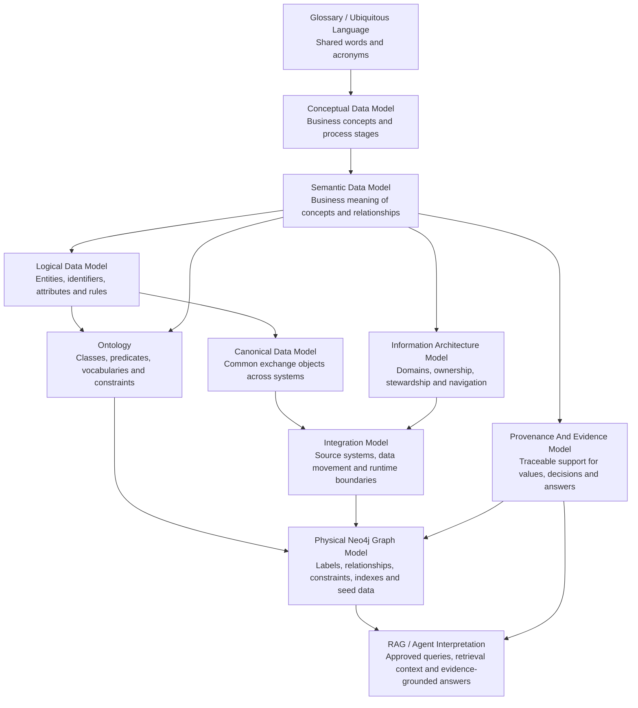
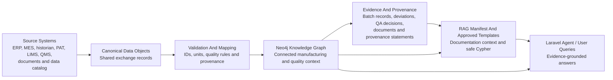

# CDC Semantic Data Model

This document explains the business meaning of the CDC manufacturing knowledge graph. It sits between the beginner handbook, the conceptual data model, the ontology, and the Neo4j implementation.

The semantic data model is a human-readable contract for what the data means. It is not the physical database design, not a regulatory filing, and not a validated GxP model.

## Purpose

The semantic data model helps information architects, ontology modelers, manufacturing data architects, quality teams, regulatory stakeholders, and AI/RAG teams agree on:

- the core business concepts in the CDC manufacturing domain;
- the meaning of important relationships;
- which concepts are master data, reference data, transactional data, evidence, or governance metadata;
- how CDC process knowledge connects to CMC, QMS, CDE, ontology, and agent evidence;
- how the Neo4j graph should be interpreted during workshops, queries, and AI-assisted analysis.

## Primary Audience

| Audience | Why They Use This Model |
| --- | --- |
| Information architects | To align language, meaning, relationships, and information domains. |
| Ontology modelers | To bridge business meaning into formal classes, predicates, and constraints. |
| Manufacturing data architects | To connect process, quality, material, equipment, run, and CDE concepts. |
| Quality and regulatory stakeholders | To understand how CMC, QMS, evidence, and disposition concepts fit together. |
| AI/RAG teams | To understand which meanings and evidence paths should ground agent answers. |

## Who Creates It In An Enterprise

The semantic data model is usually created by an **information architect**, **ontology modeler**, or **enterprise data architect**.

It should be co-created with domain SMEs from manufacturing, MSAT, quality, regulatory/CMC, data governance, and AI/RAG teams so that the model reflects both business meaning and machine interpretation needs.

## How This Relates To The Ontology

The semantic data model and ontology are related, but they are not the same artifact.

```text
Business language and glossary
-> semantic data model
-> ontology
-> Neo4j graph / RDF / SHACL / agent retrieval
```

The semantic data model explains the meaning in business terms. The ontology formalizes that meaning as classes, predicates, constraints, controlled vocabularies, and machine-readable files.

In this repository:

- `docs/semantic-data-model.md` explains what the domain concepts mean and how to interpret them.
- `docs/ontology/cdc-ontology.md` defines the formal class groups and semantic patterns.
- `docs/ontology/cdc-ontology.ttl` expresses ontology terms in RDF/OWL-style Turtle.
- `docs/ontology/cdc-shacl-shapes.ttl` expresses validation expectations in SHACL-style shapes.
- `docs/ontology/relationship-map.json` maps Neo4j relationship types to ontology predicates.
- Neo4j Cypher files implement demo instances of the model.

## Semantic Layers

The project uses several modeling layers. They should not be treated as duplicates; each layer answers a different question.

| Layer | Main Question | Artifact Examples |
| --- | --- | --- |
| Glossary | What do the words and acronyms mean? | `docs/domain-glossary.md` |
| Conceptual model | What business concepts and process stages matter? | `docs/end-to-end-cdc-conceptual-data-model.md` |
| Semantic data model | What do the concepts and relationships mean across business, quality, regulatory, and data governance contexts? | This document |
| Logical data model | Which entities, identifiers, attributes, relationships, and rules are needed before implementation? | `docs/logical-data-model.md` |
| Canonical data model | Which common exchange objects can systems share? | `docs/canonical-data-model.md` |
| Information architecture model | How is information organized, owned, governed, and navigated? | `docs/information-architecture-model.md` |
| Integration model | How could data move between systems, Neo4j, and the agent? | `docs/integration-model.md` |
| Provenance and evidence model | How are values, decisions, mappings, and answers supported by traceable evidence? | `docs/provenance-evidence-model.md` |
| Ontology | What are the formal classes, predicates, allowed patterns, vocabularies, and constraints? | `docs/ontology/` |
| Physical graph model | How is the model implemented in Neo4j? | `cypher/*.cypher` |
| Agent/RAG layer | Which evidence can an agent retrieve and cite? | `docs/rag-manifest.jsonl`, `laravel-agent/resources/cdc-agent/` |

## How The Models Fit Together

The model stack moves from human language to executable graph data.

The Mermaid source for this diagram is available at `docs/model-stack.mmd`.



```text
Ubiquitous language
  Defines shared words and acronyms.
  Example: CDE, CPP, CQA, CMC, MaterialLot.

Conceptual data model
  Describes business concepts and process stages without committing to a database design.
  Example: crystallisation -> drying -> milling -> CDC -> coating.

Semantic data model
  Explains what the concepts and relationships mean across manufacturing, quality,
  CMC, governance, and AI/RAG interpretation.
  Example: CDE is a governed definition; CDEValue is observed evidence.

Logical model
  Defines entities, identifiers, attributes, relationships, cardinality expectations,
  and reusable rules.
  Example: CriticalDataElement has owner, steward, source system, value domain, and standard mapping.

Canonical data model
  Defines common exchange objects that can be mapped from source systems into the graph.
  Example: SensorMeasurementRecord can map to SensorReading, Sensor, CQA, CPP, and ManufacturingRun.

Information architecture model
  Explains ownership, stewardship, source-system boundaries, navigation, and lifecycle.
  Example: QA owns disposition evidence; MSAT may own process CDE definitions.

Integration model
  Explains how source systems, canonical objects, Neo4j, documents, and agents fit together.
  Example: QMS deviations and historian alarms remain in source systems but are linked in Neo4j.

Provenance and evidence model
  Explains how values, mappings, and decisions are supported by traceable evidence.
  Example: StandardMapping is supported by ProvenanceStatement; CDEValue is evidenced by EvidenceDocument.

Ontology
  Formalizes meaning as classes, predicates, controlled vocabularies, and constraints.
  Example: ManufacturingRun consumes MaterialLot; CPP impacts CQA.

Physical graph model
  Implements the model in Neo4j labels, relationships, constraints, indexes, and seed data.
  Example: (run:ManufacturingRun)-[:CONSUMES]->(lot:MaterialLot).

RAG / agent model
  Uses approved queries, retrieval manifest records, graph evidence, and documentation context
  to answer questions with traceability.
  Example: answer a CDE question using Cypher evidence plus the RAG manifest.
```

The same concept can appear in several layers. For example, `MaterialLot` is:

- a glossary term for humans;
- a conceptual concept in genealogy and material flow;
- a semantic concept meaning a physical lot instance;
- an ontology class;
- a Neo4j label;
- a retrievable concept for agent answers.

The layers should stay aligned. If a label, relationship, or CDE is added to the graph, the glossary, semantic model, ontology, relationship matrix, and RAG manifest may also need updates.

The Mermaid source for typical model creators and audiences is available at `docs/model-audience-creator-matrix.mmd`.

The Mermaid source for how semantic meaning flows into ontology and Neo4j implementation is available at `docs/ontology-relationship-flow.mmd`.

## Core Business Concepts

### Product And Formulation

`Product` is the medicinal product concept being controlled. `Formulation` defines its composition. `Recipe` defines the manufacturing process used to make it.

Semantic pattern:

```text
Product -> Formulation -> Material
Product -> Recipe -> ProcessStep
Product -> CMCPackage -> RegulatoryEvidence
```

Interpretation:

- product and formulation records are master data;
- recipe and process-step definitions are governed process master data;
- CMC evidence explains and justifies how the product and process are controlled.

### Materials And Genealogy

`Material` is a material master record. `MaterialLot` is a physical lot that can be received, tested, released, consumed, and traced.

Semantic pattern:

```text
MaterialLot INSTANCE_OF Material
MaterialLot SUPPLIED_BY Supplier
ManufacturingRun CONSUMES MaterialLot
```

Interpretation:

- a material lot is not the same as the material definition;
- genealogy questions should trace from a run to consumed lots, then to material and supplier context;
- this supports impact assessment when a lot, supplier, or material attribute is questioned.

### Process And Unit Operations

`Recipe` and `ProcessStep` describe the operational CDC recipe. `UnitOperation` and `ProcessSegment` describe the broader end-to-end conceptual process from crystallisation to coated tablet collection.

Semantic pattern:

```text
ProcessSegment CONTAINS_OPERATION UnitOperation
UnitOperation NEXT_OPERATION UnitOperation
Recipe DEFINES_STEP ProcessStep
ProcessStep USES_EQUIPMENT Equipment
```

Interpretation:

- recipe steps are execution-oriented;
- unit operations are architecture-oriented and useful for CDE, standards, and source-system mapping;
- the two views overlap but are not identical.

### Assets, Equipment, Sensors, And Source Systems

`Equipment` is the physical asset used in a process step or unit operation. `Sensor` is a measuring instrument, PAT model, historian tag, or soft sensor. `DataSourceSystem` identifies the source system where a critical value originates.

Semantic pattern:

```text
Equipment HAS_SENSOR Sensor
Sensor MEASURES CPP or CQA
CriticalDataElement SOURCED_FROM DataSourceSystem
```

Interpretation:

- equipment and sensors explain where process or quality evidence came from;
- source systems explain system-of-record boundaries;
- the graph distinguishes instrument evidence from governed data-element metadata.

### Quality, Control, And Specifications

`CPP` means Critical Process Parameter. `CQA` means Critical Quality Attribute. `Specification` defines an acceptance criterion or limit. `ControlStrategy` links controls to quality outcomes.

Semantic pattern:

```text
CPP CONTROLS ProcessStep
CPP IMPACTS CQA
CQA HAS_SPECIFICATION Specification
ControlStrategy PROTECTS CQA
```

Interpretation:

- CPPs are process variables that can influence quality;
- CQAs are quality outcomes that need control;
- specifications and control strategy provide the quality interpretation layer.

### Execution, Events, And QA Disposition

`ManufacturingRun` is an executed event. `SensorReading`, `Alarm`, `Deviation`, `BatchRecord`, and `QAReleaseDecision` are execution and review evidence.

Semantic pattern:

```text
ManufacturingRun EXECUTES Recipe
SensorReading DURING_RUN ManufacturingRun
Alarm TRIGGERED_BY SensorReading
Deviation INVESTIGATES Alarm
QAReleaseDecision REVIEWS BatchRecord
QAReleaseDecision RELEASES or REJECTS ManufacturingRun
```

Interpretation:

- a run is transactional data;
- readings, alarms, deviations, and batch records are evidence;
- QA disposition is a controlled decision over the evidence, not just a status string.

### CDE Governance

`CriticalDataElement` is a governed definition of data that matters. `CDEValue` is an observed or representative value. These must not be confused.

Semantic pattern:

```text
CriticalDataElement OBSERVED_AT UnitOperation
CriticalDataElement DESCRIBES CPP or CQA or MaterialLot or Equipment
CriticalDataElement HAS_VALUE_DOMAIN ValueDomain
CDEValue VALUE_OF CriticalDataElement
CDEValue OBSERVED_DURING ManufacturingRun
```

Interpretation:

- `CriticalDataElement` is metadata;
- `CDEValue` is value evidence;
- an AI or reviewer should not treat a definition as a measured value.

## Master, Reference, Transactional, Evidence, And Governance Data

| Data Concept | Meaning | Example Labels |
| --- | --- | --- |
| Master data | Stable business definitions and core entities. | `Product`, `Formulation`, `Recipe`, `Material`, `Supplier`, `Equipment` |
| Reference data | Controlled vocabularies, standards, and classifications. | `DataStandard`, `CDEDomain`, `CriticalityLevel`, `DecisionStatus`, `RunStatus`, `UnitOfMeasure` |
| Transactional data | Executed events and run-specific records. | `ManufacturingRun`, `SensorReading`, `Alarm`, `Deviation`, `BatchRecord`, `QAReleaseDecision` |
| Evidence data | Documents, validation records, provenance, and audit context. | `EvidenceDocument`, `ValidationEvidence`, `ProvenanceStatement`, `AuditTrailEvent`, `CleaningRecord`, `CalibrationRecord` |
| Governance metadata | Definitions, ownership, stewardship, quality rules, and approvals. | `CriticalDataElement`, `DataOwner`, `DataSteward`, `DataQualityRule`, `CDEVersion`, `CDEDefinitionApproval` |

This classification matters because the same word can appear in different contexts. For example, blend uniformity can be:

- a `CQA` definition;
- a `CriticalDataElement` describing required data capture;
- a `CDEValue` observed in a run;
- an `AnalyticalResult` or `SensorReading` evidence item;
- a control strategy concern in CMC evidence.

## Relationship Semantics

Relationships are verbs with meaning. They are not just links.

| Relationship | Semantic Meaning |
| --- | --- |
| `HAS_FORMULATION` | Product is governed by a formulation definition. |
| `USES_MATERIAL` | Formulation or process definition requires a material. |
| `INSTANCE_OF` | Physical lot instantiates a material master definition. |
| `CONSUMES` | Run used a material lot as execution evidence. |
| `EXECUTES` | Run was performed according to a recipe. |
| `DEFINES_STEP` | Recipe includes a process step in its definition. |
| `NEXT_OPERATION` | Unit operation follows another in conceptual process order. |
| `MEASURES` | Sensor measures a process parameter or quality attribute. |
| `IMPACTS` | CPP can influence a CQA. |
| `HAS_SPECIFICATION` | CQA has an acceptance criterion or limit. |
| `TRIGGERED_BY` | Alarm was triggered by a reading or process condition. |
| `INVESTIGATES` | Deviation investigation covers an alarm or issue. |
| `REVIEWS` | QA decision reviews a batch record. |
| `RELEASES` / `REJECTS` | QA disposition decision applied to a manufacturing run. |
| `MAPS_TO_STANDARD` | CDE is aligned to a standard or guidance context. |
| `SUPPORTS_CMC_SECTION` | CDE supports a CTD/CMC regulatory section. |
| `SUPPORTED_BY_PROVENANCE` | Mapping or assertion has an explicit source context. |

## Standards And Governance Context

The model uses standards and guidance as architecture context, not as validated regulatory claims.

The semantic model connects CDC data to:

- CMC / CTD Module 3 sections for regulatory evidence structure;
- ICH guidance context for pharmaceutical quality and continuous manufacturing;
- ISO/IEC 11179 concepts for data element definitions and metadata registry thinking;
- ISA-95 / IEC 62264 concepts for manufacturing source-system boundaries;
- ISO 14644 and ISO 22400 style context for cleanroom and operations data.

These mappings support architecture discussion, CDE governance, and evidence traceability. They should be reviewed and validated by qualified domain owners before any regulated use.

## AI, RAG, And Agent Interpretation

The semantic data model helps AI-assisted workflows avoid unsupported answers.

The Mermaid source for the data-to-evidence flow is available at `docs/data-to-evidence-flow.mmd`.



An agent should interpret answers through this chain:

```text
Question
-> approved question/template context
-> relevant semantic concepts
-> Neo4j graph evidence
-> supporting document/RAG manifest context
-> answer with traceable caveats
```

Useful guardrails:

- retrieve definitions before interpreting values;
- distinguish CDE definitions from CDE values;
- prefer graph paths and evidence documents over unsupported summaries;
- cite provenance where standards mappings are used;
- treat demo data as reference architecture evidence, not validated GxP evidence.

## Example Semantic Statements

These statements describe the domain in business language:

- A product has a formulation and recipe that define how it should be manufactured.
- A manufacturing run executes a recipe on a line at a site using material lots.
- Material genealogy traces a run back to lots, material masters, and suppliers.
- A CPP can impact one or more CQAs.
- A CQA should have a specification or acceptance criterion.
- A sensor reading is meaningful only when linked to the sensor, run, measured concept, and specification context.
- A deviation investigates an alarm or quality event and becomes part of the batch review evidence.
- A QA release decision reviews the batch record and releases or rejects the run.
- A CDE defines governed data; a CDE value records example observed evidence.
- CDEs can support CMC sections and map to standards when provenance is available.

## Limitations

This semantic data model is production-inspired but simplified. It is intended for reference architecture, ontology, data architecture, and AI/RAG discussion.

It is not:

- a validated GxP semantic model;
- a complete pharmaceutical ontology;
- a regulatory submission;
- a replacement for client-specific process, quality, data, or regulatory governance.
